# 1.1. Design Sprint

## Introdução

A Design Sprint é uma metodologia desenvolvida pelo Google Ventures que condensa semanas de trabalho em cinco dias, passando por fases de entendimento, esboço, decisão, prototipagem e validação. O objetivo é responder a perguntas críticas de negócio através de design e teste com usuários reais, reduzindo riscos antes de iniciar o desenvolvimento.

## Etapa 1 - Unpack (Entender)

### Definição da Stack Tecnológica

O grupo iniciou debatendo as tecnologias a serem utilizadas. Cada membro trouxe sua perspectiva:

- João Lobo sugeriu Java para o back-end;
- Otávio e Lucas propuseram Flutter;
- Dannyeclisson se posicionou contra React Native.

Após debate, o grupo convergiu para uma solução **web mobile-first**, equilibrando familiaridade técnica e escopo da disciplina:

| Camada | Tecnologia Escolhida |
|--------|---------------------|
| Frontend | React (Mobile First) |
| Backend | Express + TypeScript |
| Banco de Dados | PostgreSQL via Supabase |

### Brainstorming

O grupo realizou uma sessão de brainstorming para definir a mecânica central do produto. Foram exploradas três iterações:

**Ideia 1 — Batalha em tempo real:**
Jogo multiplayer onde cada pergunta acertada dispara um ataque ao adversário em tempo real. Descartada pelo grupo pois o tempo de resposta das perguntas tornaria a experiência inviável e a complexidade de sincronização estaria fora do escopo.

**Ideia 2 — Batalha assíncrona com fase de perguntas prévia:**
As perguntas seriam respondidas antes de cada batalha, acumulando recursos para o combate contra outro usuário. Descartada por ser pesada demais para o escopo da disciplina.

**Ideia Final (aprovada por todos):**
As perguntas são respondidas antes de cada jogo para acumular moedas. Com as moedas, o jogador enfrenta ondas de inimigos em um jogo de **tower defense**. O formato de jogo competitivo ficou em aberto para iterações futuras.

### Sessão de perguntas
Além disso, foi feita uma segunda reunião, para alinhar o fluxo completo:

#### Fase de Perguntas

Pergunta 1: O jogador responde perguntas sozinho (single-player) ou ainda existe algum componente multiplayer/competitivo nessa fase?

**Marina:** Acredito que dentro do escopo que entregaremos na disciplina, melhor manter sozinho. Futuramente poderia ser adicionado como um modo de jogo.

**Lucas:** Inicialmente, o foco será no modo individual, permitindo que o jogador estude no seu próprio ritmo. Como evolução, pode ser incluído um aspecto competitivo opcional, como comparação de pontuações com amigos ou participação em desafios semanais.

**Gabriela:** O jogador pode responder sozinho. Poderia ter um componente competitivo opcional, como comparar pontuações com amigos ou participar de desafios semanais, como features adicionais ao MVP.

**João Lobo:** Single-player é suficiente, para gastar mais energia em outras features.

**João Sapiência:** O foco deve ser totalmente single-player. Isso elimina a complexidade técnica de sincronizar jogadores em tempo real e nos permite direcionar os esforços de desenvolvimento para as mecânicas principais.

**Otávio:** O jogador responde perguntas sozinho.

**Thiago:** Single-player para focar no desenvolvimento e permitir perguntas mais complicadas.

Pergunta 2: As perguntas são organizadas por prova/disciplina (ex: ENEM Matemática) ou o jogador escolhe livremente?

**Marina:** Eu colocaria organizada por concurso/vestibular.

**Lucas:** As questões serão estruturadas por disciplinas ou provas (ex: Matemática ENEM), facilitando um estudo direcionado. Além disso, haverá um modo livre, permitindo ao jogador praticar de forma mais ampla, semelhante a um simulado.

**Gabriela:** Seria interessante organizar por prova/disciplina para facilitar o estudo focado, mas também permitir uma opção de "modo livre" para quem quiser praticar de forma mais variada, tal como um simulado.

**João Lobo:** Poderia ser personalizado: só uma banca, selecionar bancas, ou tudo misturado.

**João Sapiência:** A flexibilidade é o ideal. O jogador pode montar seu próprio filtro, escolhendo bancas específicas, matérias separadas ou até gerando um simulado misto.

**Otávio:** As perguntas são organizadas por prova e, ao selecionar a prova, é mostrada uma roleta para definir a matéria dentro dela. Quando a questão é exibida, também aparece a quantidade de moedas que ela vale (questões mais difíceis valem mais) e o valor vai reduzindo conforme o tempo passa, até um limite de 5 minutos, valorizando quem responde mais rápido.

**Thiago:** Separar por tópicos — a pessoa usa o software com um propósito de estudo, perguntas fora do escopo dela seriam desinteressantes.

Pergunta 3: Existe um limite de perguntas por sessão? (ex: 10 perguntas por rodada, ou joga até cansar?)

**Marina:** Colocaria com limite sim, mas podemos considerar fazer sem limite como um modo de jogo.

**Lucas:** A ideia é sugerir um número padrão de questões por sessão (como 10 ou 20), ajudando a manter o foco. Ainda assim, o jogador poderá escolher encerrar quando quiser ou ajustar a quantidade de perguntas.

**Gabriela:** Poderia haver um limite de perguntas por sessão para manter o foco e evitar fadiga, como 10 ou 20 perguntas (base/default), mas também permitir que o jogador escolha quando encerrar a sessão e a quantidade de perguntas.

**João Lobo:** Entre 5 a 15, com opção de personalizar a quantidade.

**João Sapiência:** Sessões curtas e configuráveis. Algo entre 5 e 15 questões, onde o próprio usuário define o tamanho do bloco que quer responder.

**Otávio:** O jogador pode jogar até cansar.

**Thiago:** Até cansar.

Pergunta 4: A recompensa em moedas depende de quê? Apenas acerto? Também velocidade? Combo/streak de acertos consecutivos?

**Marina:** Diria acerto, dificuldade, velocidade.

**Lucas:** O ganho de moedas será baseado principalmente nos acertos. Para tornar a experiência mais dinâmica, também haverá bônus por respostas rápidas e um sistema de sequência (streak), aumentando a recompensa conforme o jogador mantém consistência.

**Gabriela:** A recompensa poderia ser baseada principalmente nos acertos, mas também incluir um bônus por velocidade e um sistema de streak para incentivar a consistência. Por exemplo, cada acerto vale 10 moedas, com um bônus de 5 moedas por resposta rápida (dentro de 30 segundos) e um multiplicador de streak que aumenta a cada acerto consecutivo.

**João Lobo:** Apenas acerto e streak consecutivos, pois o tema é delicado.

**João Sapiência:** Foco apenas em acertos e multiplicadores de sequência (streaks). Colocar pressão de tempo pode gerar frustração, já que o estudo em si já é um tema delicado.

**Otávio:** Respondido na pergunta 2: acerto + dificuldade + velocidade (valor decai com o tempo).

**Thiago:** Streak é indispensável para manter atenção e vontade do usuário. Velocidade não sabe se cabe na ideia geral.

Pergunta 5: Existe um tempo limite por pergunta ou o jogador responde no seu ritmo?

**Marina:** Colocaria sem limite de tempo, mas podemos considerar fazer com limite de tempo como um modo de jogo, para as pessoas poderem testar o tempo de resposta delas.

**Lucas:** Será adotado um tempo padrão por questão (por exemplo, 60 segundos), trazendo mais desafio. No entanto, haverá um modo alternativo sem limite de tempo, ideal para estudo mais tranquilo.

**Gabriela:** Poderia haver um tempo limite para adicionar um elemento de desafio, como 60 segundos por pergunta, mas também permitir que o jogador escolha jogar sem limite de tempo (modo ZEN) para praticar no seu ritmo.

**João Lobo:** Poderia ser personalizado, para o usuário alternar o "modo".

**João Sapiência:** O usuário deve ditar o ritmo. Podemos deixar isso como uma configuração, permitindo que ele alterne o modo de jogo caso queira treinar sob pressão.

**Otávio:** O jogador responde no seu ritmo.

**Thiago:** No seu ritmo.

Pergunta 6: Após errar, o jogador vê a resposta correta/explicação, ou apenas segue em frente?

**Marina:** Acho isso bem importante.

**Lucas:** Após errar uma questão, o jogador terá acesso à resposta correta junto com uma explicação resumida. Também poderá existir um modo em que o feedback é apresentado apenas ao final da sessão, para quem preferir maior desafio.

**Gabriela:** Seria importante mostrar a resposta correta e uma explicação breve para promover o aprendizado. Ter um modo de jogo onde isso é opcional, mostrando apenas no final as respostas, para quem quiser um desafio maior.

**João Lobo:** Apenas o erro, com liberdade de pesquisar a resposta na internet.

**João Sapiência:** A plataforma apenas acusa o erro. Se o jogador quiser entender o motivo, ele tem a autonomia para pesquisar a resolução na internet.

**Otávio:** Ele vê a resposta certa e a explicação.

**Thiago:** Com certeza deveria ver, pois a base do software é o estudo.

#### Economia de Moedas

Pergunta 7: As moedas servem apenas para o tower defense (comprar torres, upgrades) ou também para cosméticos/perfil?

**Marina:** Apenas tower defense.

**Lucas:** No MVP, as moedas serão utilizadas exclusivamente no modo tower defense. Em versões futuras, podem ser incorporados elementos adicionais, como personalizações de perfil ou itens cosméticos.

**Gabriela:** Inicialmente, as moedas poderiam ser usadas apenas para o tower defense para manter o foco, mas futuramente poderiam ser introduzidos itens cosméticos ou melhorias de perfil como opções adicionais.

**João Lobo:** Apenas no tower defense.

**João Sapiência:** Uso exclusivo para as mecânicas do tower defense.

**Otávio:** Servem também para cosméticos e perfil.

**Thiago:** Seria interessante incluir o perfil, principalmente para adicionar pessoas próximas e aumentar a distribuição do software.

Pergunta 8: Existe um limite de moedas que se pode acumular antes de jogar o tower defense?

**Marina:** Não vejo porquê.

**Lucas:** Não haverá restrição rígida de acúmulo inicialmente, permitindo que o jogador administre seus recursos livremente. Caso necessário, limites podem ser definidos posteriormente.

**Gabriela:** Não vejo necessidade de um limite de moedas — isso permitiria que os jogadores acumulem e planejem melhor suas estratégias. Poderia haver um limite máximo para evitar acúmulo excessivo, mas não seria necessário para o MVP.

**João Lobo:** Podemos colocar um limite.

**João Sapiência:** Sim, impor um "cap" (limite máximo) é uma boa estratégia para forçar o jogador a gastar e transicionar para a fase do jogo.

**Otávio:** Existe um limite por nível do tower defense.

**Thiago:** Acha interessante, mas ainda não sabe como balancear.

Pergunta 9: As moedas são gastas permanentemente no tower defense (a cada partida você usa e perde), ou são persistentes?

**Marina:** Gasta permanentemente.

**Lucas:** As moedas serão consumidas a cada partida no tower defense, incentivando o jogador a retornar à fase de perguntas para continuar evoluindo.

**Gabriela:** Gastar permanentemente faria mais sentido para criar um desafio e incentivar o estudo contínuo. Isso também adiciona um elemento de risco/recompensa ao jogar o tower defense, tornando as decisões de compra mais estratégicas.

**João Lobo:** Apenas durante a partida (gasta na partida).

**João Sapiência:** Elas são consumíveis. O que for gasto durante aquela partida do TD é consumido permanentemente.

**Otávio:** As moedas usadas no tower defense são gastas permanentemente.

**Thiago:** São gastas, mas tem que valer a pena o investimento.

Pergunta 10: Existe alguma outra forma de ganhar moedas além de responder perguntas? (ex: login diário, missões)

**Marina:** A princípio não, só colocaria se fôssemos adicionar outros modos de jogo.

**Lucas:** Para simplificar o escopo inicial, a única forma de obtenção será por meio das questões. Futuramente, podem ser adicionadas mecânicas como recompensas diárias ou missões.

**Gabriela:** Para o MVP, focar apenas nas moedas ganhas por responder perguntas seria mais simples. Futuramente poderiam ser introduzidos login diário, missões diárias/semanais ou eventos especiais.

**João Lobo:** Seria interessante o login diário.

**João Sapiência:** Implementar bônus de login diário seria excelente para a retenção de usuários.

**Otávio:** Inicialmente não.

**Thiago:** Outra forma interessante de prender o usuário, ficaria legal.

#### Fase de Tower Defense

Pergunta 11: O tower defense é PvP (jogador vs jogador, cada um com suas torres) ou PvE (jogador vs ondas de inimigos controlados pelo sistema)?

**Marina:** PvE.

**Lucas:** O modo inicial será PvE, com o jogador enfrentando ondas de inimigos controlados pelo sistema. Isso reduz a complexidade e facilita a implementação do MVP.

**Gabriela:** Para o MVP, focar em um modo PvE seria mais simples e permitiria que os jogadores se acostumassem com a mecânica do tower defense antes de introduzir a complexidade do PvP.

**João Lobo:** PvE.

**João Sapiência:** Foco 100% em PvE.

**Otávio:** O tower defense é PvE inicialmente.

**Thiago:** PvE (com talvez uma futura atualização PvP).

Pergunta 12: Se for PvP: é em tempo real simultâneo (ambos jogam ao mesmo tempo) ou assíncrono (você ataca a base do outro que já foi montada)?

**Marina:** Colocaria como uma opção de jogo, mas fora do escopo da disciplina.

**Lucas:** Caso seja implementado posteriormente, o PvP poderá explorar tanto partidas em tempo real quanto modos assíncronos.

**Gabriela:** Não se aplica para o MVP. Se um modo PvP for introduzido futuramente, poderia ser interessante explorar ambos os formatos (tempo real e assíncrono) para oferecer diferentes experiências de jogo.

**João Lobo:** Não se aplica.

**João Sapiência:** Não se aplica, já que definimos como PvE.

**Otávio:** Deixar assíncrono seria uma ideia interessante.

**Thiago:** Ao mesmo tempo (tempo real).

Pergunta 13: As moedas ganhas nas perguntas são usadas dentro da partida para comprar/posicionar torres? Ou são usadas antes para montar um deck/loadout?

**Marina:** Eu acho que é mais justo antes.

**Lucas:** As moedas serão utilizadas antes da partida para definir o conjunto de torres (loadout). Durante a partida, poderão existir recursos limitados adicionais para ajustes estratégicos.

**Gabriela:** As moedas seriam usadas antes da partida para montar um deck/loadout de torres, adicionando um elemento de estratégia e planejamento. Durante a partida, os jogadores poderiam ganhar recursos adicionais para fazer compras limitadas, mas o grosso do investimento seria feito na preparação.

**João Lobo:** Antes da partida.

**João Sapiência:** O gasto principal acontece antes, na preparação e montagem da estratégia/deck.

**Otávio:** As moedas podem ser usadas dentro da partida para powerups ou torres especiais, e também para evoluir "heróis" (similar ao Clash of Clans).

**Thiago:** Aproveitar os dois mundos (antes e durante).

Pergunta 14: Quanto tempo dura uma partida de tower defense em média? (1-2 min? 5 min? 10+ min?)

**Marina:** No mín 3:00, no máx 5:00.

**Lucas:** As partidas terão curta duração, entre 1 e 3 minutos, garantindo uma experiência rápida e envolvente.

**Gabriela:** Para manter o jogo dinâmico, as partidas poderiam durar entre 1 a 3 minutos em média, dependendo da dificuldade e do número de ondas.

**João Lobo:** 1 a 3 minutos.

**João Sapiência:** Partidas bem dinâmicas, com duração média de 1 a 3 minutos.

**Otávio:** Podem ter níveis com durações diferentes, mas em média 5 minutos.

**Thiago:** Depende do quão forte o jogador esteja — muito forte fica bastante tempo, fraco perde rápido.

Pergunta 15: O tower defense tem temática educacional (ex: torres com nomes de disciplinas, inimigos representando "ignorância") ou é temática separada?

**Marina:** Acho legal mantermos a temática.

**Lucas:** Inicialmente, será adotada uma temática neutra para facilitar o desenvolvimento. Elementos educacionais poderão ser incorporados em versões futuras.

**Gabriela:** A temática educacional poderia ser interessante para reforçar a conexão entre as perguntas e o tower defense (torres por disciplina, inimigos representando "ignorância"). Para o MVP, uma temática mais neutra poderia ser mais fácil de implementar, com elementos educacionais futuramente.

**João Lobo:** A temática pode ser separada.

**João Sapiência:** A temática do TD pode ser totalmente separada e independente do contexto educacional.

**Otávio:** Temática separada.

**Thiago:** Manter o tema educacional.

Pergunta 16: A inspiração principal é o Bloons TD 6 (referência na ata). Quais elementos do BTD6 vocês querem manter? (mapa fixo, tipos de torre variados, upgrades em árvore, ondas progressivas?)

**Marina:** Sei pouco sobre o jogo para opinar sobre isso.

**Lucas:** Variedade de torres com funções distintas, mapas com layouts diferentes e sistema de evolução das torres.

**Gabriela:** Mapas variados com diferentes layouts, tipos de torres variadas com diferentes habilidades e sistema de upgrades em árvore para personalizar as torres.

**João Lobo:** Estilo dos mapas, ondas progressivas e tipos de torres variadas.

**João Sapiência:** Resgatar o design dos mapas, a variedade de funções de cada torre e o sistema de ondas (waves) progressivas.

**Otávio:** Mapa fixo, tipos de torre variados, upgrades em árvore e ondas progressivas. O jogador tem dois tipos de moedas: as das questões (usadas para torres especiais, upgrades e powerups) e moedas dentro da partida (usadas para melhorar torres comuns).

**Thiago:** Mapa fixo e upgrades de torres. O resto ainda precisaria testar se caberia.

Pergunta 17: Existe matchmaking por nível/elo ou qualquer jogador joga contra qualquer um?

**Marina:** Acho que existem níveis diferentes de rodada — rodadas mais difíceis, rodadas mais fáceis. E cada uma que o jogador ganha, ele passa para a próxima. Sendo PvP, mudaria o formato.

**Lucas:** Não se aplica ao MVP, já que o foco é no modo PvE. Em um possível modo PvP, poderá ser considerado um sistema de pareamento por nível.

**Gabriela:** Em um modo PvE, o matchmaking não se aplica. Se um modo PvP for introduzido futuramente, poderia ser interessante implementar matchmaking por nível/elo para garantir partidas equilibradas.

**João Lobo:** Pode ser qualquer um contra qualquer um.

**João Sapiência:** Como é PvE, não há restrições complexas de matchmaking. Qualquer um pode jogar de forma livre.

**Otávio:** Por enquanto não, pois será apenas contra o computador.

**Thiago:** Por nível ficaria bom.

#### Loop Geral e Progressão

Pergunta 18: O loop ideal seria: Estudar → Ganhar moedas → Jogar TD → Repetir. Existe algo mais nesse ciclo? (ex: abrir novos mapas, desbloquear torres?)

**Marina:** A princípio, faria apenas assim. Depois, fora do escopo da disciplina, poderia ser adicionado mais.

**Lucas:** O ciclo central será: responder perguntas → acumular moedas → jogar tower defense → repetir. No futuro, podem ser adicionados elementos de progressão como desbloqueio de conteúdo.

**Gabriela:** Esse loop básico é sólido para o MVP. Futuramente poderiam ser adicionados elementos como desbloqueio de novos mapas, torres ou modos de jogo para manter os jogadores engajados.

**João Lobo:** Talvez usar as moedas para liberar níveis antes, e na partida você consegue upar até o nível que liberou.

**João Sapiência:** As moedas servem para "desbloquear" o nível máximo que uma torre pode alcançar no menu. Durante a partida, você só consegue evoluir aquela torre até o nível que já foi liberado previamente com as moedas.

**Otávio:** Inicialmente não há nada além do loop base.

**Thiago:** Sim: abrir novos mapas, desbloquear torres e upgrades.

Pergunta 19: Existe um sistema de nível/XP do jogador além das moedas? O que ele desbloqueia?

**Marina:** Acho que não, pelo menos no começo.

**Lucas:** No MVP, a progressão será baseada apenas nas moedas. Um sistema de níveis pode ser introduzido posteriormente para liberar novos conteúdos.

**Gabriela:** Para o MVP, focar apenas nas moedas como forma de progressão seria mais simples. Futuramente poderia ser interessante introduzir um sistema de nível/XP que desbloqueie torres especiais, mapas adicionais ou modos exclusivos.

**João Lobo:** Apenas moedas.

**João Sapiência:** Manter o sistema simples focado apenas nas moedas, sem XP de jogador.

**Otávio:** Inicialmente não.

**Thiago:** Sim, XP ao eliminar inimigos e ao passar rodadas.

Pergunta 20: Existe ranking/leaderboard? Se sim, é baseado em performance no TD, nas perguntas, ou ambos?

**Marina:** Podemos ter mais de um: quem ganha mais batalhas, quem ganhou mais moedas, quem acertou mais questões.

**Lucas:** Inicialmente, o ranking será baseado no desempenho nas questões. Futuramente, pode haver rankings separados para o modo tower defense.

**Gabriela:** Para o MVP, um ranking baseado nas perguntas respondidas poderia incentivar a competição saudável. Futuramente, um ranking específico para o tower defense também poderia ser introduzido.

**João Lobo:** Ranking baseado nas perguntas.

**João Sapiência:** Ranking baseado puramente no desempenho dos estudos (acertos na fase de perguntas).

**Otávio:** Inicialmente, apenas um ranking baseado nas perguntas respondidas (cada moeda ganha por responder equivale a um ponto — perguntas mais difíceis valem mais).

**Thiago:** Seria interessante em ambos (TD e perguntas).

Pergunta 21: Existem temporadas ou a progressão é contínua?

**Marina:** Acho que contínuo.

**Lucas:** A progressão será contínua no início, sem divisão por temporadas.

**Gabriela:** Para o MVP, uma progressão contínua seria mais simples de implementar.

**João Lobo:** Progressão contínua.

**João Sapiência:** A progressão será contínua.

**Otávio:** A progressão é contínua.

**Thiago:** No momento, contínua.

Pergunta 22: Existem conquistas/achievements? (ex: "Acertou 50 questões de matemática", "Venceu 10 partidas de TD")

**Marina:** Gosto bastante da ideia.

**Lucas:** Não fazem parte do MVP, mas podem ser adicionadas depois para aumentar o engajamento.

**Gabriela:** Para o MVP, focar nas funcionalidades principais seria mais importante. Futuramente poderiam ser introduzidos achievements para incentivar os jogadores a explorar diferentes aspectos do jogo.

**João Lobo:** Não.

**João Sapiência:** Não teremos sistema de conquistas no momento.

**Otávio:** Inicialmente não.

**Thiago:** Sim, ficaria bom.

#### Escopo do MVP

Pergunta 23: Para o MVP da disciplina, quais funcionalidades são essenciais vs "legal ter depois"?

**Marina:**
- [x] Login/cadastro
- [x] Responder perguntas
- [x] Ganhar moedas
- [x] Tower defense básico funcional
- [x] PvE (PvP fora do escopo)
- [x] Ranking
- [x] Perfil com estatísticas
- [x] Painel admin para questões

**Lucas:**
- [x] Sistema de login e cadastro
- [x] Resolução de questões por disciplina
- [x] Sistema de moedas
- [x] Tower defense funcional (modo PvE)
- [x] Ranking baseado nas questões
- [x] Perfil do jogador com estatísticas
- [x] Painel administrativo para gerenciamento de questões

**Gabriela:**
- [x] Login/cadastro
- [x] Responder perguntas
- [x] Ganhar moedas
- [x] Tower defense básico funcional
- [x] PvE funcional (PvP fora do escopo)
- [x] Ranking (apenas das questões)
- [x] Perfil com estatísticas
- [x] Painel admin para questões

**João Lobo:**
- [x] Login/cadastro
- [x] Responder perguntas
- [x] Ganhar moedas
- [x] Tower defense básico funcional
- [x] PvE
- [x] Ranking
- [ ] Perfil com estatísticas
- [ ] Painel admin para questões

**João Sapiência:**
- [x] Login/cadastro
- [x] Responder perguntas
- [x] Ganhar moedas
- [x] Tower defense básico funcional
- [x] PvE
- [x] Ranking
- [ ] Perfil com estatísticas (fica para depois)
- [ ] Painel admin para questões (fica para depois)

**Otávio:**
- [x] Login/cadastro
- [x] Responder perguntas
- [x] Ganhar moedas
- [x] Tower defense básico funcional
- [x] PvE
- [x] Ranking (apenas das questões)
- [x] Perfil com estatísticas
- [x] Painel admin para questões

**Thiago:**
- [x] Login/cadastro
- [x] Responder perguntas
- [x] Ganhar moedas
- [x] Tower defense básico funcional
- [ ] PvP — PvE funcional
- [ ] Ranking
- [x] Perfil com estatísticas
- [ ] Painel admin para questões

Pergunta 24: Para o MVP, o tower defense pode ser simplificado (ex: menos tipos de torre, mapa único)? Qual o nível mínimo aceitável?

**Marina:** Acredito que sim, importante simplificar. O nível mínimo seria ter 3 mapas e ao menos 5 tipos de defesa com 3 atualizações cada.

**Lucas:** O TD será simplificado, com poucos tipos de torres (ex: 3) e um único mapa. O objetivo é garantir que a mecânica principal funcione bem, mesmo com escopo reduzido.

**Gabriela:** O tower defense simplificado com um número limitado de tipos de torres (por exemplo, 3 tipos básicos) e um mapa único para focar na implementação da mecânica principal. O nível mínimo seria ter uma experiência funcional onde os jogadores possam usar as moedas para comprar torres e enfrentar ondas de inimigos.

**João Lobo:** Um único mapa para focar na animação, devido a limitações técnicas.

**João Sapiência:** Ter apenas um mapa já é o suficiente. Considerando nossas restrições técnicas, é mais inteligente ter um único mapa bem polido e com boas animações do que tentar abraçar um escopo maior.

**Otávio:** Menos tipos de torres. Inicialmente 3 mapas com dificuldades diferentes.

**Thiago:** Se tivessem 10 torres no PvE, no PvP distribuir 4 torres de forma aleatória para ambos (as mesmas torres), ficaria balanceado.

### É/Não É · Faz/Não Faz

Para alinhar expectativas de escopo, o grupo realizou a dinâmica **É/Não É · Faz/Não Faz**, consolidando o que o produto é e o que está fora do escopo desta entrega.

> 🔗 [Acessar board no Miro](https://miro.com/app/board/uXjVGpn6IrM=/)

### Comprobatórios de Participação

**Participação no É não é, faz não faz:**

| Participante | Histórico Miro |
|---|---|
| Ana Elisa |  |
| Dannyeclisson |  |
| Eric |  |
| João Lobo |  |
| João Sapiência |  |
| Lucas |  |
| Marina |  |
| Otávio |  |
| Thiago |  |

**Participação na rodada de perguntas:**

| Membro | Commit |
|--------|--------|
| Gabriela | [d45fcfa](https://github.com/UnBArqDsw2026-1-Turma02/2026.01-T02_G6_Battle_Class_Entrega_01/commit/d45fcfa) |
| João Lobo | [9bcd5d3](https://github.com/UnBArqDsw2026-1-Turma02/2026.01-T02_G6_Battle_Class_Entrega_01/commit/9bcd5d3) |
| João Sapiência | [6740a3c](https://github.com/UnBArqDsw2026-1-Turma02/2026.01-T02_G6_Battle_Class_Entrega_01/commit/6740a3c) |
| Lucas | [9c8c113](https://github.com/UnBArqDsw2026-1-Turma02/2026.01-T02_G6_Battle_Class_Entrega_01/commit/9c8c113) |
| Marina | [80bbd35](https://github.com/UnBArqDsw2026-1-Turma02/2026.01-T02_G6_Battle_Class_Entrega_01/commit/80bbd35) |
| Otávio | [da51197](https://github.com/UnBArqDsw2026-1-Turma02/2026.01-T02_G6_Battle_Class_Entrega_01/commit/da51197) |
| Thiago | [262e331](https://github.com/UnBArqDsw2026-1-Turma02/2026.01-T02_G6_Battle_Class_Entrega_01/commit/262e331) |

## Etapa 2 - Sketch (Esboçar)

Após o alinhamento do Unpack, cada membro da equipe produziu individualmente um **Rich Picture** (representação visual livre de como imaginava o sistema). Essa técnica permite externalizar modelos mentais diferentes antes de convergir para uma solução única.

### Comprobatórios de Participação

| Autor | Rich Picture | Commit |
|-------|-------------|--------|
| Ana Elisa |  | [3d4b0e0](https://github.com/UnBArqDsw2026-1-Turma02/2026.01-T02_G6_Battle_Class_Entrega_01/commit/3d4b0e0) |
| Dannyeclisson |  | [60b7a3b](https://github.com/UnBArqDsw2026-1-Turma02/2026.01-T02_G6_Battle_Class_Entrega_01/commit/60b7a3bb17e36589995aa88228218fa4b54a1cd8) |
| Eric Akio |  | [0bd56af](https://github.com/UnBArqDsw2026-1-Turma02/2026.01-T02_G6_Battle_Class_Entrega_01/commit/0bd56af) |
| Gabriela Tiago | 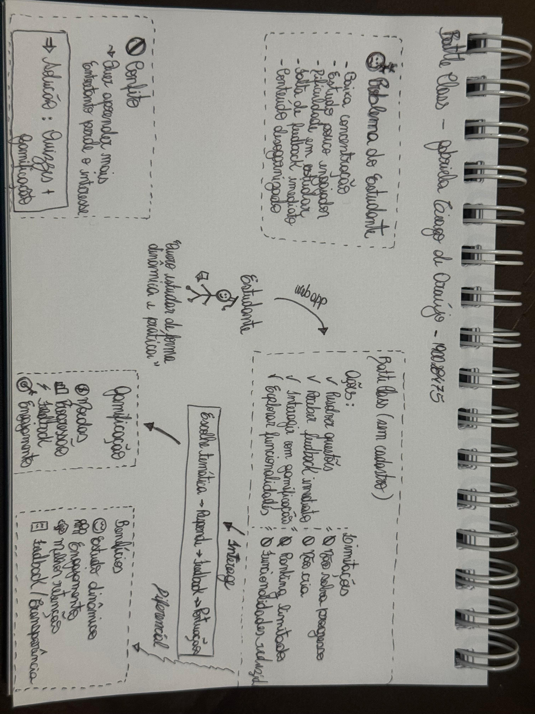 | [283927d](https://github.com/UnBArqDsw2026-1-Turma02/2026.01-T02_G6_Battle_Class_Entrega_01/commit/283927d) |
| João Lobo |  | [0a9aa87](https://github.com/UnBArqDsw2026-1-Turma02/2026.01-T02_G6_Battle_Class_Entrega_01/commit/0a9aa87) |
| João Sapiência |  | [5612440](https://github.com/UnBArqDsw2026-1-Turma02/2026.01-T02_G6_Battle_Class_Entrega_01/commit/5612440) |
| Lucas Oliveira |  | [bc9721e](https://github.com/UnBArqDsw2026-1-Turma02/2026.01-T02_G6_Battle_Class_Entrega_01/commit/bc9721e) |
| Marina |  | [06e107f](https://github.com/UnBArqDsw2026-1-Turma02/2026.01-T02_G6_Battle_Class_Entrega_01/commit/06e107f) |
| Otávio |  | [90432be](https://github.com/UnBArqDsw2026-1-Turma02/2026.01-T02_G6_Battle_Class_Entrega_01/commit/90432be) |
| Thiago |  | [0d954c5](https://github.com/UnBArqDsw2026-1-Turma02/2026.01-T02_G6_Battle_Class_Entrega_01/commit/0d954c5) |

## Etapa 3 - Decision (Decidir)

O grupo realizou uma reunião para avaliar os Rich Pictures produzidos na etapa anterior e escolher a visão que melhor representava o sistema.

### Rich Picture Escolhido

O grupo escolheu o Rich Picture da **Marina** como base, por ser o mais completo, lúdico, didático e por consolidar os pontos discutidos no Unpack. A partir dele, foram feitas discussões sobre os fluxos do sistema, gerando uma segunda versão refinada.

| Versão | Descrição | Imagem |
|--------|-----------|--------|
| Versão 1 (Original) | Rich Picture inicial da Marina |  |
| Versão 2 (Refinado) | Versão final após discussões de fluxo |  |

### Comprobatórios de Participação
Nesta reunião, além de escolher o rich picture, o grupo alinhou envio de artefatos, status de protótipos e prazos para entrega. Estavam presentes, segundo registro da nossa ferramenta:

Ata registrada pela ferramenta:
> O grupo alinhou envio de artefatos, status de protótipos e prazos para entrega final da apresentação, com prazo de envio ao repositório até segunda-feira e apresentação final na sexta-feira. A equipe confirmou que vários membros já subiram ou vão subir rich pictures, perguntas e protótipos de baixa fidelidade, e combinou que todos devem publicar prints no Git Pages para revisão da equipe e da professora.
Foi revisado o BPMN com feedback positivo sobre qualidade visual e setas, e discutida a sequência do Design Sprint (definir, prototipar, validar) e a consolidação de protótipos de baixa fidelidade em um protótipo de alta fidelidade para apresentação. Definiu-se distinção entre verificação e validação — verificação como checklist interno e validação como testes com usuários reais — e acordou-se realizar validação com cerca de 3–5 usuários, com cada membro ajudando a recrutar participantes ou contribuindo com perguntas para um formulário compartilhado. Atribuíram-se responsabilidades claras: João produzirá o protótipo de alta fidelidade, Marina fará o Rich Picture final, Ana atualizará o Git/GitPages, Lucas ficará responsável pela pesquisa/persona e perguntas no Forms, e CriaNex (Otávio) compilará decisões e redigirá o documento da solução vencedora.

## Etapa 4 - Prototype (Prototipar)

### Protótipo de Alta Fidelidade

Nossa estratégia foi elaborar versões de protótipos de baixa com base em toda a discussão anterior e compilar estas ideias em um protótipo de alta. Cada um fez um protótipo de baixa e o **João Lobo** elaborou o de alta fidelidade:

<iframe 
  src="prototipo/battle-class-pc.html"
  width="390" 
  height="780" 
  style="border:none;border-radius:14px;box-shadow:0 4px 20px rgba(0,0,0,0.2);display:block;margin:0 auto">
</iframe>

### Comprobatórios de Participação

| Autor | Protótipo | Commit |
|-------|-----------|--------|
| Ana Elisa |  | [a63dfce](https://github.com/UnBArqDsw2026-1-Turma02/2026.01-T02_G6_Battle_Class_Entrega_01/commit/a63dfce) |
| Dannyeclisson |  | [93e8439](https://github.com/UnBArqDsw2026-1-Turma02/2026.01-T02_G6_Battle_Class_Entrega_01/commit/93e8439) |
| Gabriela Tiago |  | [30a1832](https://github.com/UnBArqDsw2026-1-Turma02/2026.01-T02_G6_Battle_Class_Entrega_01/commit/30a1832) |
| João Carlos Lobo | Protótipo de alta a partir dos de baixa *(enviado por WhatsApp pelo João Lobo)* | — |
| João Sapiência |  | [6740a3c](https://github.com/UnBArqDsw2026-1-Turma02/2026.01-T02_G6_Battle_Class_Entrega_01/commit/6740a3c) |
| Lucas |  | [1965c3d](https://github.com/UnBArqDsw2026-1-Turma02/2026.01-T02_G6_Battle_Class_Entrega_01/commit/1965c3d) |
| Marina |  | [d53161c](https://github.com/UnBArqDsw2026-1-Turma02/2026.01-T02_G6_Battle_Class_Entrega_01/commit/d53161c) |
| Otávio |  | [a63dfce](https://github.com/UnBArqDsw2026-1-Turma02/2026.01-T02_G6_Battle_Class_Entrega_01/commit/a63dfce) |

## Etapa 5 - Test (Testar/Validar)

### Validação com Terceiros

A validação do protótipo foi realizada por meio de um formulário online (Google Forms), aplicado a usuários que representam o público-alvo do sistema (vestibulandos). Montamos as perguntas e a estrutura juntos.

[🔗 Acessar o formulário ](https://docs.google.com/forms/d/e/1FAIpQLSf-o04PBOSa-WExWILyXQLy6Qi6U_oOLk6envbmDJnn0TY7cw/viewform) 
[📊 Ver resultados ](https://docs.google.com/forms/d/1BAppmbG951ek_u4UQ_MsgUHwkaWCG_9WzdgYiODZbhk/edit)

Este foi o forms:
<h4 style="text-align:center; margin-top: 30px;">Introdução e Protótipo</h4>

  

    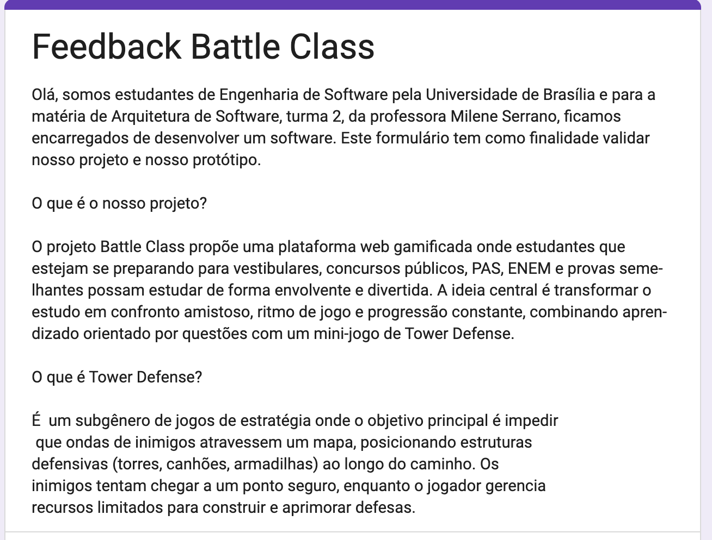
  

  

    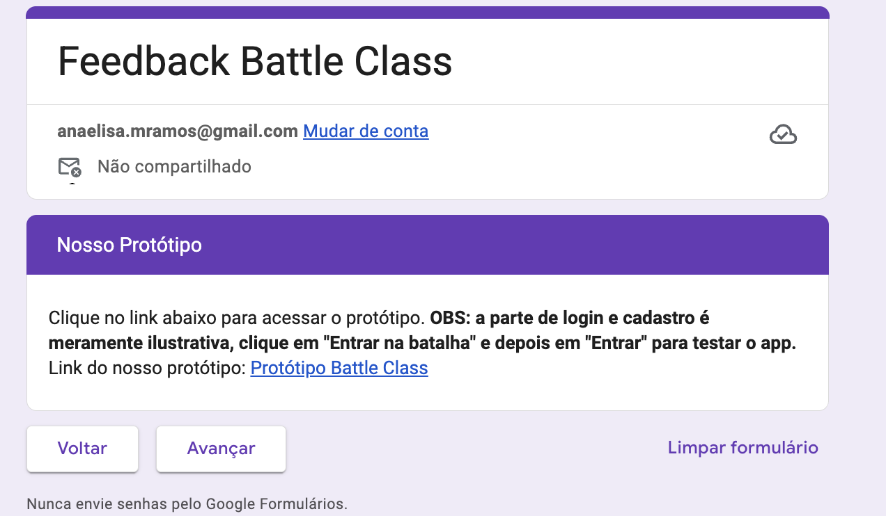
  

<h4 style="text-align:center; margin-top: 30px;">Avaliação da Dinâmica do Jogo</h4>

  

    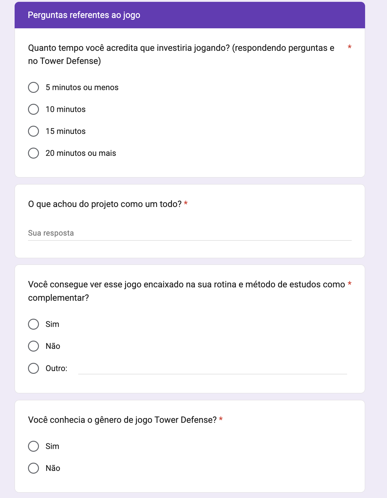
  

  

    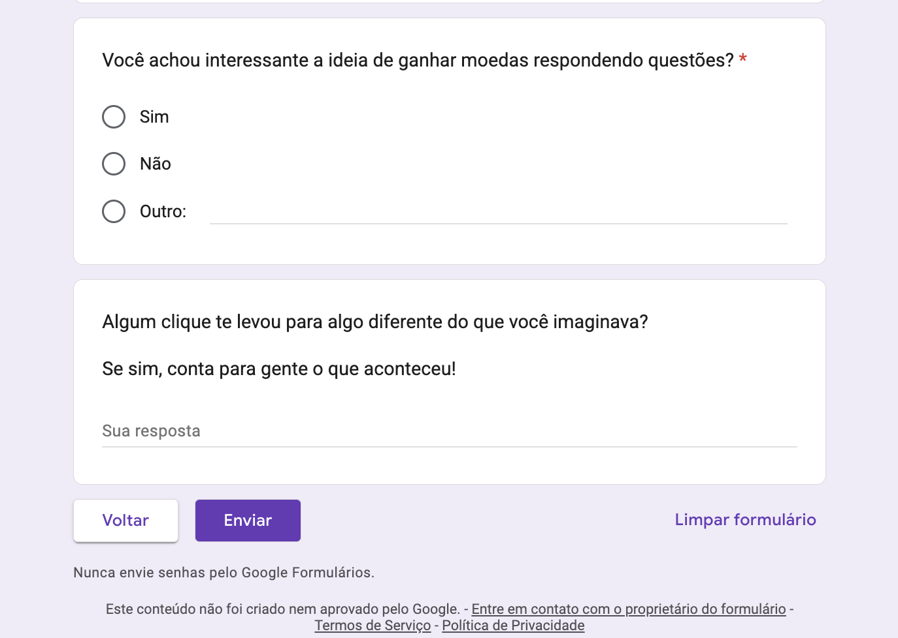
  

<h4 style="text-align:center; margin-top: 30px;">Informações do Usuário</h4>

  

    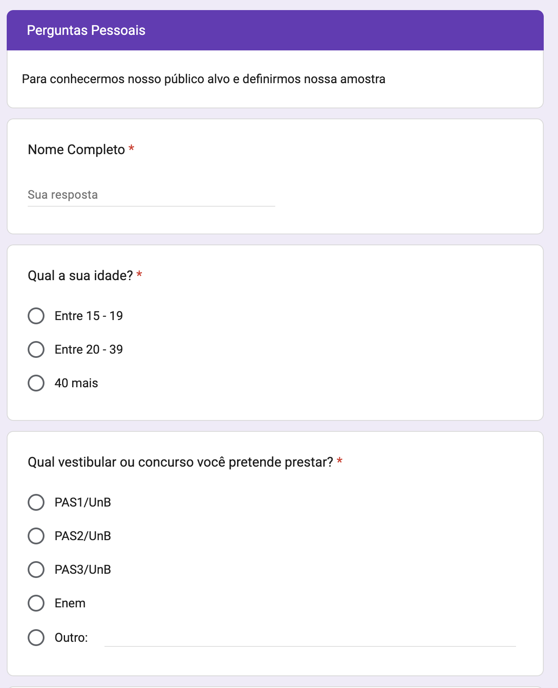
  

  

    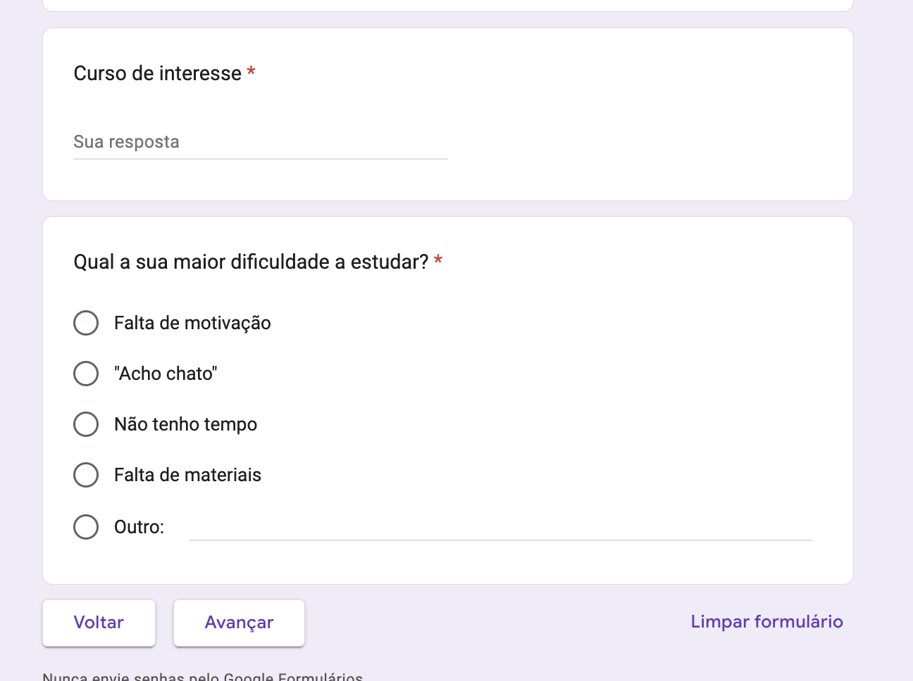
  

<h3 style="text-align:center; margin-top: 40px;">Resultados da Validação (até 05/04/2026, com 10 entrevistados)</h3>

<h4 style="text-align:center; margin-top: 30px;">Perfil dos Usuários</h4>

  

    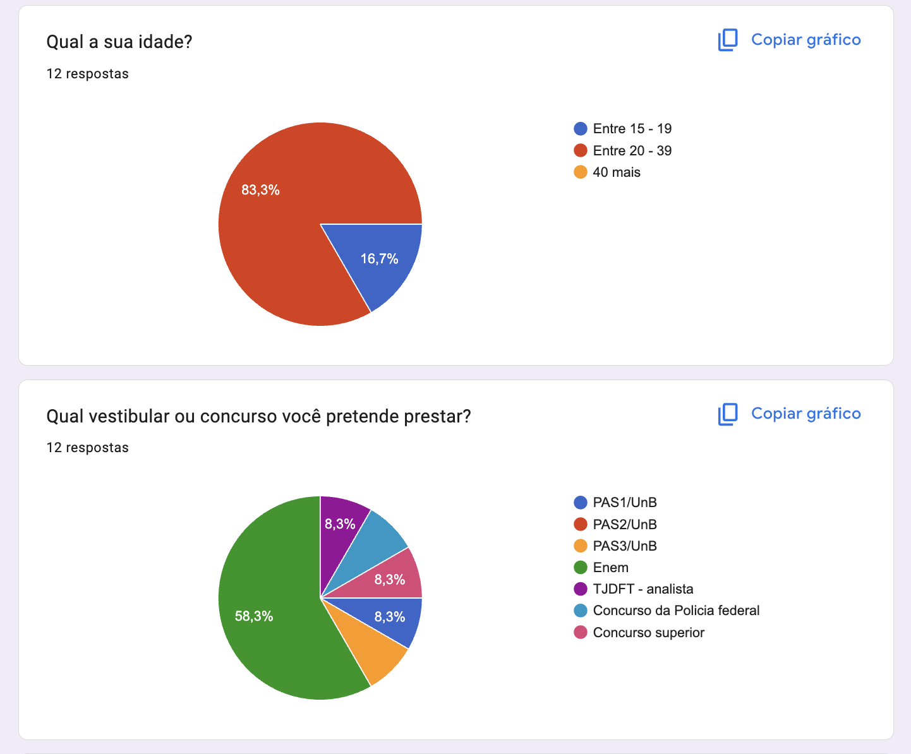
  

  

    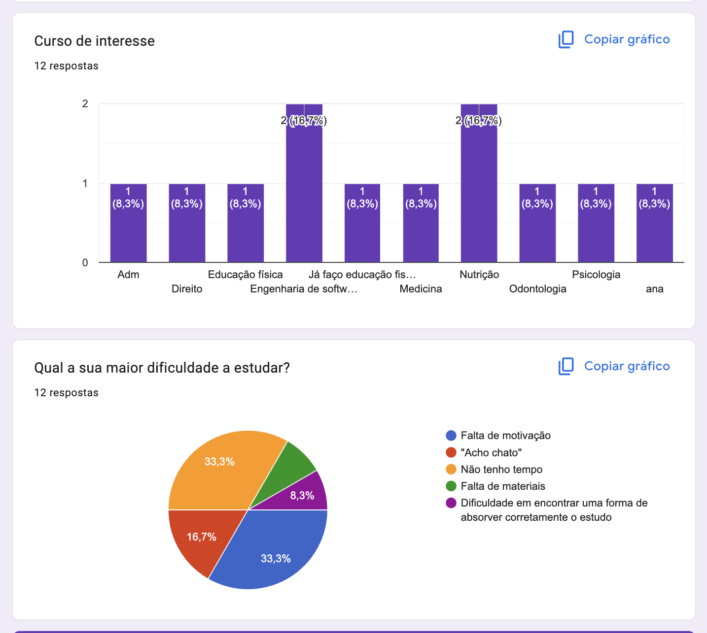
  

<h4 style="text-align:center; margin-top: 30px;">Engajamento e Interesse</h4>

  

    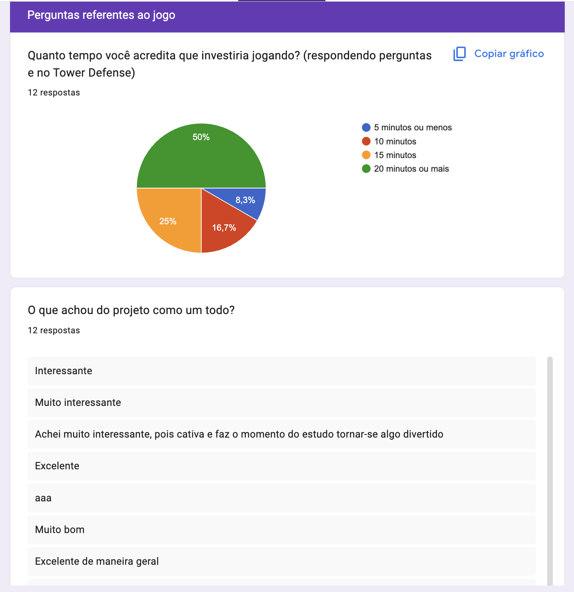
  

<h4 style="text-align:center; margin-top: 30px;">Dores e Problemas Identificados</h4>

  

    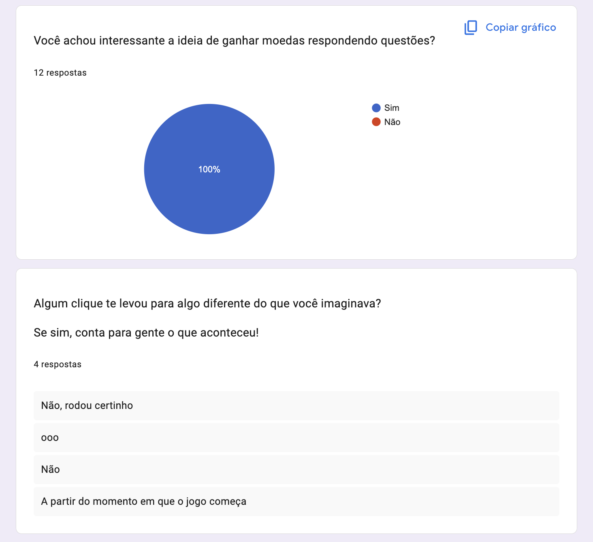
  

  

    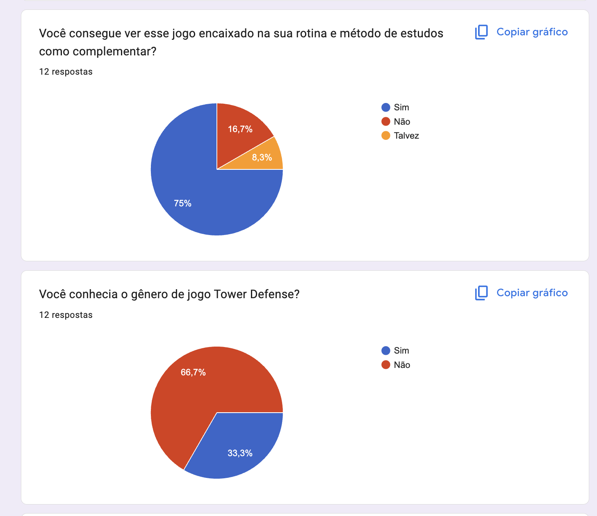
  

### Verificação

Decidimos realizar a verificação por meio de um checklist estruturado, encabeçado pelo <strong>Lucas Oliveira</strong>:

<strong>1. Entendimento do Problema</strong>

<input type="checkbox" checked disabled> O problema está claramente definido? → Sim 
Justificativa: O grupo definiu como problema central a baixa motivação e engajamento dos estudantes em métodos tradicionais de estudo.

<input type="checkbox" checked disabled> O público-alvo foi identificado? → Sim 
Justificativa: O foco está em estudantes que se preparam para provas, como ENEM, concursos e vestibulares.

<input type="checkbox" checked disabled> Foram levantadas dores reais dos usuários? → Parcial 
Justificativa: As dores foram discutidas com base em experiências do grupo, sem pesquisa formal externa.

<input type="checkbox" checked disabled> Existe um objetivo claro para a solução? → Sim 
Justificativa: Tornar o estudo mais engajador por meio de gamificação.

<strong>2. Ideação</strong>

<input type="checkbox" checked disabled> Foram geradas múltiplas ideias de solução? → Sim 
Justificativa: O grupo explorou diferentes abordagens antes da decisão.

<input type="checkbox" checked disabled> As ideias consideram diferentes abordagens? → Sim 
Justificativa: Foram avaliadas alternativas como competição direta e progressão individual.

<input type="checkbox" checked disabled> Houve participação ativa do grupo na ideação? → Sim 
Justificativa: Todos os integrantes contribuíram ativamente.

<input type="checkbox" checked disabled> As ideias foram documentadas? → Parcial 
Justificativa: Predominância de registros textuais, com pouca utilização de sketches visuais.

<strong>3. Decisão</strong>

<input type="checkbox" checked disabled> Existe um critério claro para escolha da solução? → Parcial 
Justificativa: Considerou-se viabilidade e simplicidade, sem uso de métodos formais estruturados.

<input type="checkbox" checked disabled> A solução escolhida resolve o problema principal? → Sim 
Justificativa: Uso de gamificação para aumentar o engajamento.

<input type="checkbox" checked disabled> O grupo chegou a um consenso? → Sim 
Justificativa: Decisão acordada coletivamente.

<input type="checkbox" checked disabled> Foi definida uma proposta clara de solução? → Sim 
Justificativa: Sistema dividido em perguntas e tower defense.

<strong>4. Prototipação</strong>

<input type="checkbox" checked disabled> O protótipo representa o fluxo principal do sistema? → Sim 
Justificativa: Perguntas → moedas → jogo.

<input type="checkbox" checked disabled> O nível de fidelidade é adequado? → Sim 
Justificativa: Foram desenvolvidos protótipos de baixa e alta fidelidade.

<input type="checkbox" checked disabled> As principais funcionalidades estão representadas? → Sim 
Justificativa: Perguntas, moedas e jogo estão presentes.

<input type="checkbox" checked disabled> O protótipo é navegável/simulável? → Sim 
Justificativa: Permite visualização e interação com o fluxo.

<strong>5. Testes com Usuários</strong>

<input type="checkbox" checked disabled> O protótipo foi testado com usuários reais? → Sim 
Justificativa: Aplicação via formulário com público-alvo.

<input type="checkbox" checked disabled> Foram coletados feedbacks relevantes? → Sim 
Justificativa: Identificação de melhorias no fluxo e clareza.

<input type="checkbox" checked disabled> Os usuários entenderam a proposta do sistema? → Sim 
Justificativa: Compreensão geral da dinâmica perguntas + jogo.

<input type="checkbox" checked disabled> Foram identificados pontos de melhoria? → Sim 
Justificativa: Ajustes de usabilidade e clareza das mecânicas.

<strong>6. Coerência da Solução</strong>

<input type="checkbox" checked disabled> A solução resolve o problema inicial? → Sim 
Justificativa: A gamificação aumenta o engajamento dos usuários.

<input type="checkbox" checked disabled> O fluxo do usuário é lógico e intuitivo? → Sim 
Justificativa: Sequência clara: estudar → ganhar recursos → jogar.

<input type="checkbox" checked disabled> Existe consistência entre ideia, protótipo e objetivo? → Sim 
Justificativa: Total alinhamento entre os elementos.

<input type="checkbox" checked disabled> A solução é viável para implementação futura? → Sim 
Justificativa: Escopo reduzido para um MVP viável.

<strong>7. Documentação</strong>

<input type="checkbox" checked disabled> Todas as etapas do Design Sprint foram registradas? → Sim 
Justificativa: Documentação contínua ao longo do projeto.

<input type="checkbox" checked disabled> As decisões do grupo estão documentadas? → Sim 
Justificativa: Registradas no material produzido.

<input type="checkbox" checked disabled> O protótipo está acessível? → Sim 
Justificativa: Disponível por link.

<input type="checkbox" checked disabled> O material está organizado e compreensível? → Sim 
Justificativa: Estrutura clara e lógica para leitura.

### Comprobatórios de Participação 

| Participante | Pergunta criada |
|---|---|
| Ana Elisa | 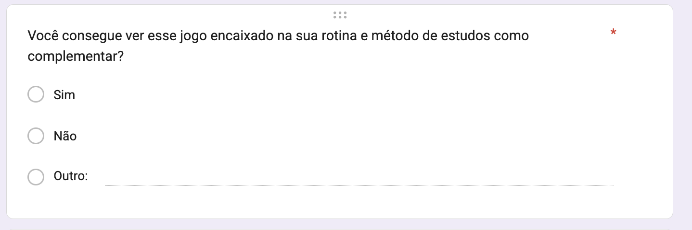 |
| Dannyeclisson | 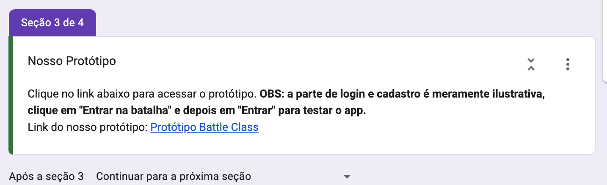 |
| Eric | 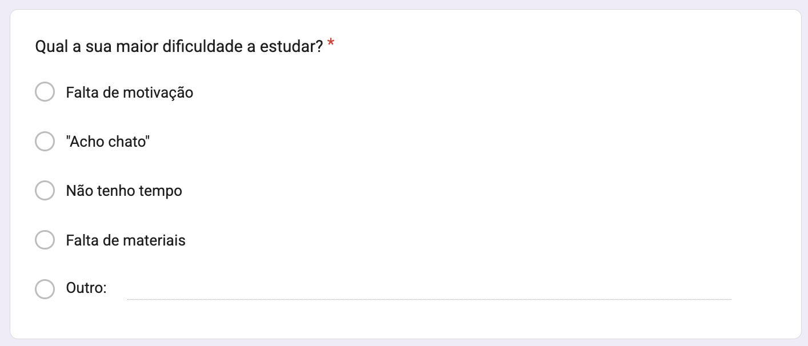 |
| João Lobo | 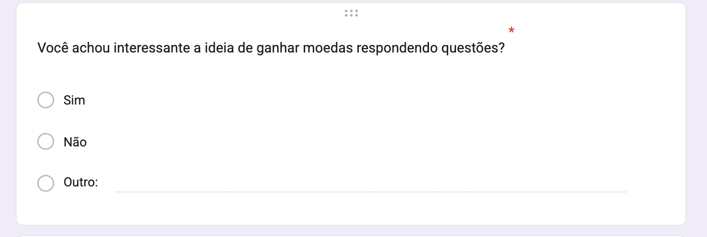 |
| João Sapiência | 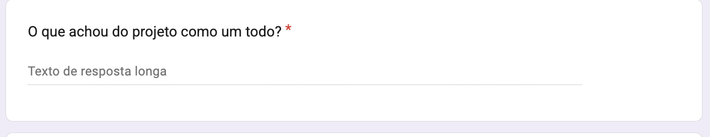 |
| Lucas | 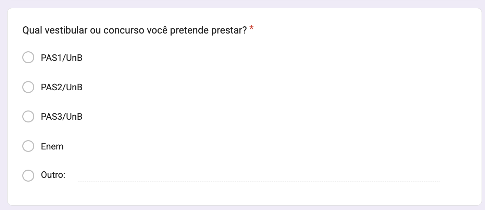 |
| Marina | 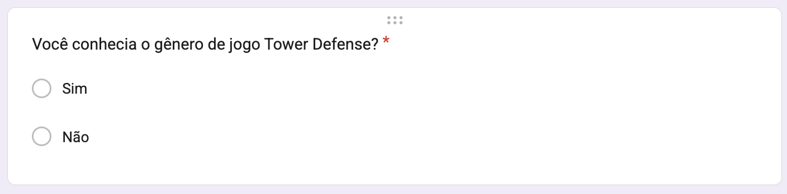 |
| Thiago | 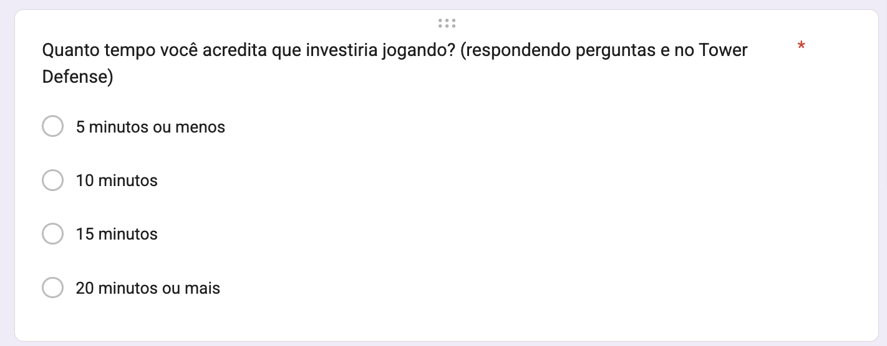 |

## Rastreabilidade e Elos com Outros Artefatos

- **Artefato Generalista — Fishbone (1.2)**: As causas mapeadas no diagrama de causa e efeito (dificuldade de estudar) foram o ponto de partida do Unpack, definindo o problema central que a Design Sprint buscou resolver.
- **Modelagem BPMN (1.3)**: Os fluxos definidos nas etapas de Sketch e Decision embasaram a modelagem dos processos no BPMN.
- **Protótipo**: O protótipo de alta fidelidade é o artefato final da Design Sprint, consolidando todas as decisões tomadas nas etapas anteriores.

## Senso Crítico

A Design Sprint adaptada pelo grupo funcionou bem para alinhar rapidamente as visões individuais sobre o sistema. O uso de Rich Pictures permitiu externalizar modelos mentais distintos antes de convergir para uma solução.

Pontos positivos:
- A dinâmica "É/Não É · Faz/Não Faz" foi eficaz para delimitar o escopo e evitar discussões improdutivas.
- A escolha do Rich Picture da Marina como base para o protótipo final foi consensual e acelerou a etapa de decisão.
- O protótipo de alta fidelidade ficou fiel ao conceito definido no Unpack.

Pontos de melhoria:
- Nem todos os membros entregaram Rich Pictures e protótipos de baixa fidelidade, o que reduziu a diversidade de perspectivas na etapa de Sketch.
- A validação com usuários reais ainda não foi realizada — é um passo crítico para confirmar as hipóteses levantadas.
- O processo foi conduzido de forma assíncrona em alguns momentos, o que dificultou a colaboração em tempo real.

## Histórico de Versões

| Versão | Data | Descrição | Autor(es) | Revisor(es) |
|--------|------|-----------|-----------|-------------|
| 1.0 | 05/04/2026 | Realização do ciclo |Ana Elisa, Dannyeclisson, Eric, Gabriela Tiago, João Carlos Lobo, João Victor Sapiência, Lucas, Marina, Otávio e Thiago| — |

## Referências

- KNAPP, Jake; ZERATSKY, John; KOWITZ, Braden. **Sprint: How to Solve Big Problems and Test New Ideas in Just Five Days**. Simon & Schuster, 2016.
- GOOGLE VENTURES. **The Design Sprint**. Disponível em: https://www.gv.com/sprint/
- CAROLI, Paulo. **Lean Inception**. Disponível em: https://caroli.org/lean-inception-3/
