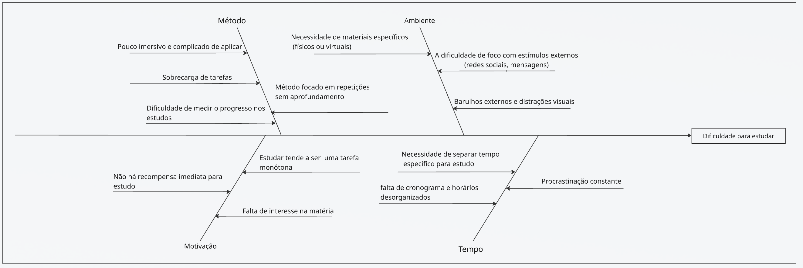
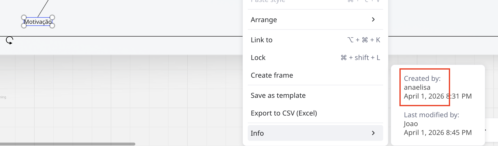
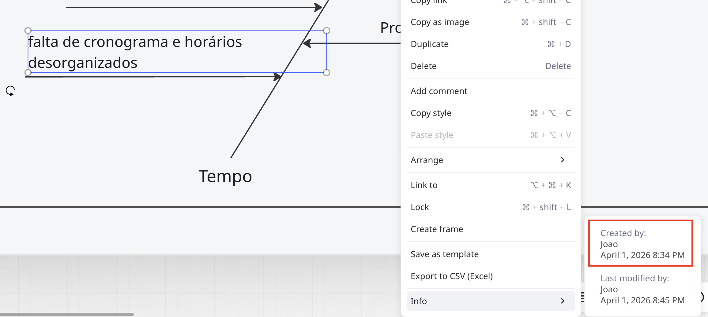
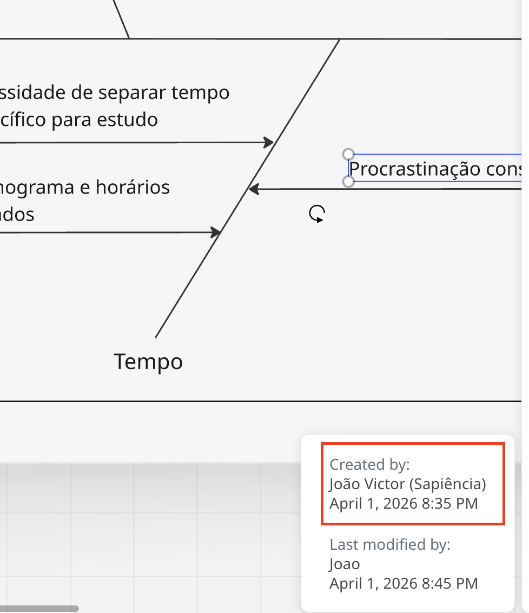
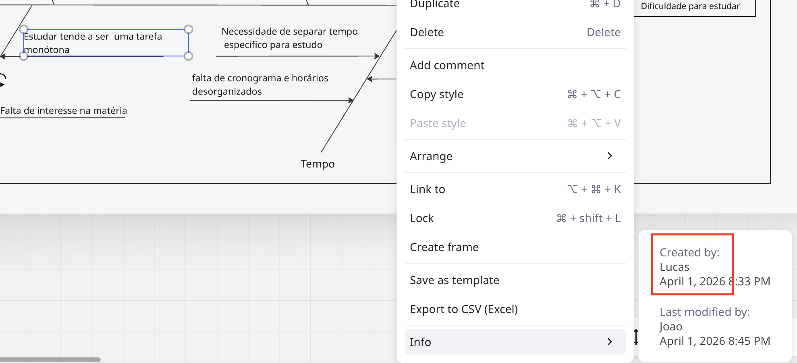
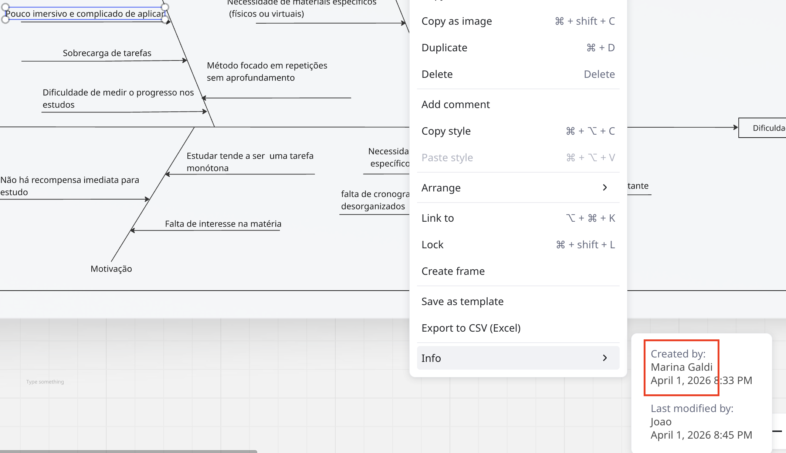
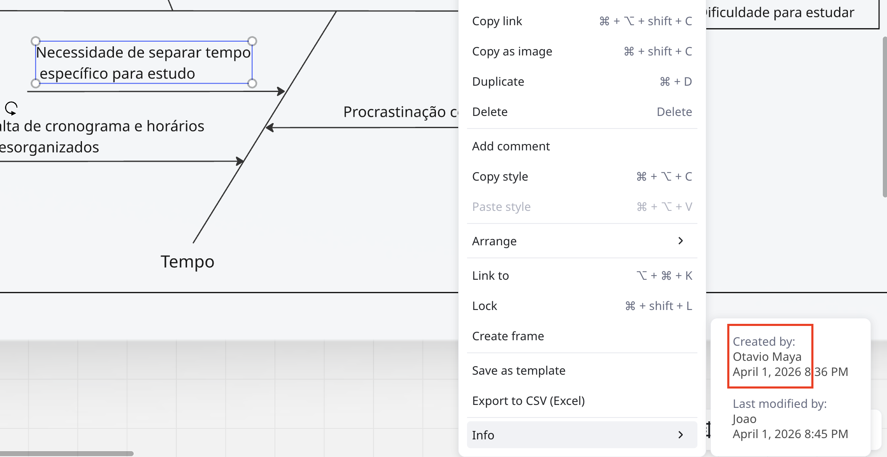

# 1.2. Módulo Artefato Generalista

## Introdução

O Diagrama de Causa e Efeito (também conhecido como Diagrama de Ishikawa ou Fishbone) é uma ferramenta de análise visual que organiza as possíveis causas de um problema em categorias, facilitando a identificação das raízes do problema central. Ele é independente de metodologia, podendo ser aplicado em qualquer contexto de projeto.

A equipe optou por esse artefato para mapear as causas da **dificuldade para estudar** — problema central que o Battle Class se propõe a resolver — organizando-as nas categorias: **Método**, **Ambiente**, **Motivação** e **Tempo**.

## Metodologia

O diagrama foi construído colaborativamente pela equipe durante a fase de levantamento de requisitos. Cada membro contribuiu com causas identificadas a partir de experiências próprias como estudantes, consolidadas em uma sessão de discussão em grupo.

## Artefato

> 🔗 [Acessar board no Miro](https://miro.com/app/board/uXjVGoFnTsg=/)

### Descrição das Categorias

| Categoria | Causas Identificadas |
|-----------|----------------------|
| **Método** | Pouco imersivo e complicado de aplicar; Sobrecarga de tarefas; Método focado em repetições sem aprofundamento; Dificuldade de medir o progresso nos estudos |
| **Ambiente** | Necessidade de materiais específicos (físicos ou virtuais); Dificuldade de foco com estímulos externos (redes sociais, mensagens); Barulhos externos e distrações visuais |
| **Motivação** | Não há recompensa imediata para estudo; Estudar tende a ser uma tarefa monótona; Falta de interesse na matéria |
| **Tempo** | Necessidade de separar tempo específico para estudo; Falta de cronograma e horários desorganizados; Procrastinação constante |

## Rastreabilidade e Elos com Outros Artefatos

- **Design Sprint (1.1)**: As causas identificadas neste diagrama alimentaram a etapa de Unpack da Design Sprint, definindo os problemas que a solução precisava endereçar.
- **Modelagem BPMN (1.3)**: A necessidade de método mais imersivo e recompensas imediatas justifica as escolhas metodológicas e o fluxo modelado no BPMN.
- **Protótipo**: As funcionalidades de quiz com moedas e tower defense são respostas diretas às causas de falta de motivação e ausência de recompensa imediata.

## Senso Crítico

**Pontos fortes:**
- O diagrama revelou que o problema de estudar é multifatorial, envolvendo desde o método até o ambiente, o que orientou a equipe a criar uma solução que ataque múltiplas causas simultaneamente (gamificação + foco + progresso mensurável).
- A abordagem colaborativa garantiu diversidade de perspectivas, enriquecendo o levantamento.

**Limitações:**
- O diagrama não prioriza as causas por impacto ou frequência — uma análise de Pareto complementar poderia ter guiado melhor as decisões de priorização de funcionalidades.
- Algumas causas identificadas (ex: barulhos externos) estão fora do escopo de uma solução de software, mas foram mantidas para registrar o contexto completo do problema.

## Comprobatórios de Participação

Histórico de edição no Miro por membro:

| Membro | Evidência |
|--------|-----------|
| Ana Elisa Ramos |  |
| João Carlos Lobo |  |
| João Victor Sapiência |  |
| Lucas Oliveira Ferreira |  |
| Marina Agostini Galdi |  |
| Otávio Maya |  |

## Histórico de Versões

| Versão | Data | Descrição | Autor(es) | Revisor(es) |
|--------|------|-----------|-----------|-------------|
| 1.0 | 05/04/2026 | Criação do diagrama de causa e efeito | Ana Elisa, João Lobo, João Sapiência, Lucas, Marina, Otávio | - |

## Referências

- ISHIKAWA, Kaoru. *Guide to Quality Control*. Asian Productivity Organization, 1976.
- SERRANO, Milene. Arquitetura e Desenho de Software — Aula Projeto-DSW. UnB/FGA.
