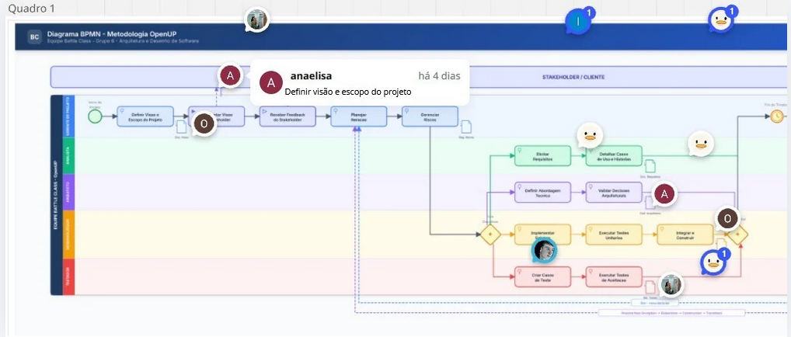
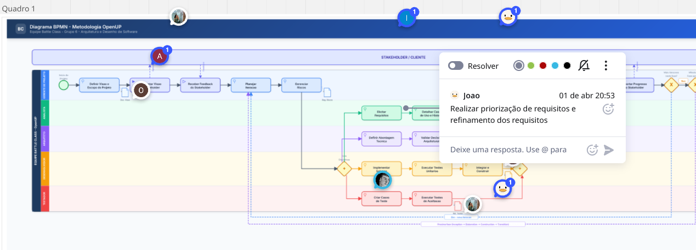
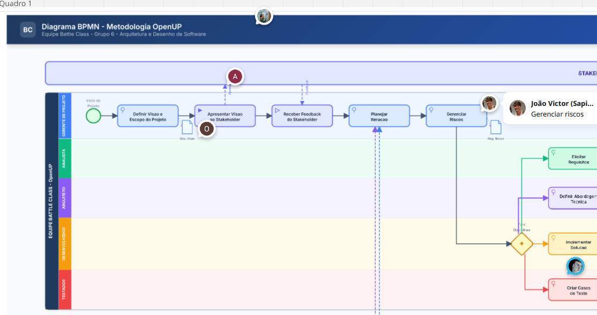
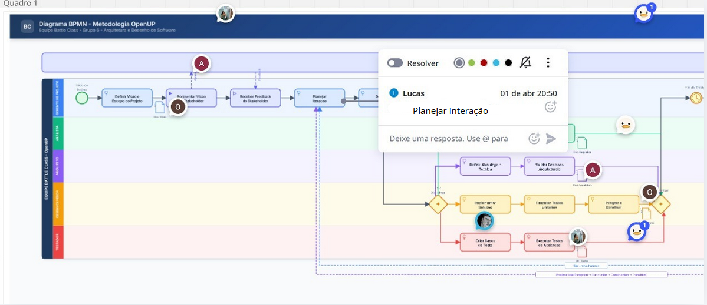
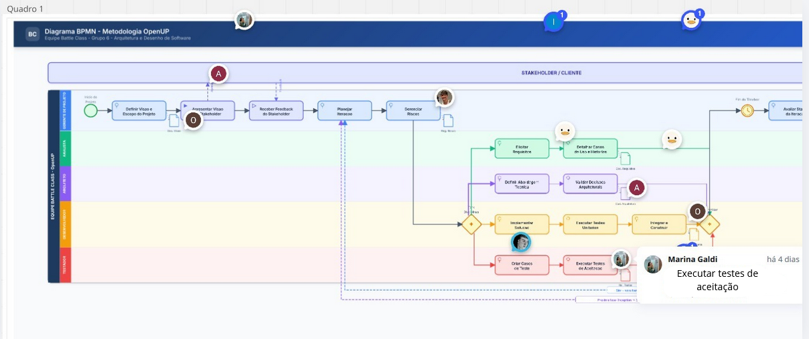
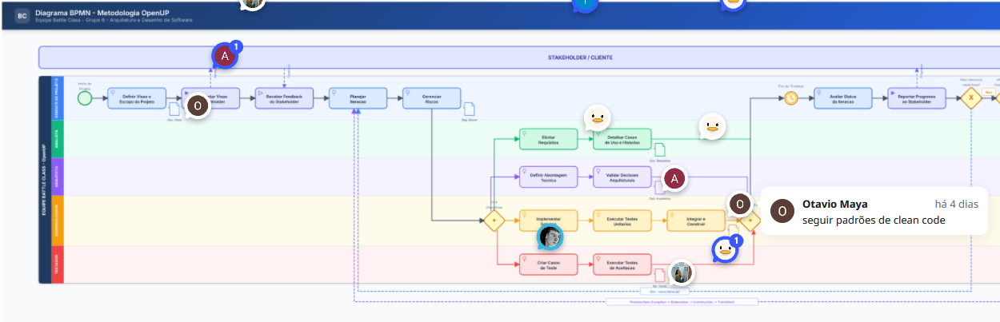
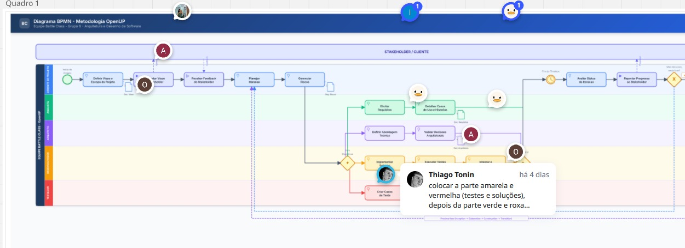

# 1.3. Módulo Modelagem BPMN

## Introdução

A modelagem BPMN (Business Process Model and Notation) é uma notação padronizada pela OMG (Object Management Group) para a diagramação de fluxos de processos de negócio. Neste módulo, a equipe Battle Class utilizou a notação BPMN 2.0 para modelar o detalhamento metodológico do projeto, representando o fluxo de trabalho adotado pela equipe com base na metodologia **OpenUP** (Open Unified Process).

## Metodologia Adotada

A equipe adotou a metodologia **OpenUP**, uma abordagem iterativa e incremental derivada do RUP (Rational Unified Process), mantida pela Eclipse Foundation. A escolha se justifica por:

- **Processo leve e adaptável**: OpenUP é minimalista comparado ao RUP, adequado para equipes acadêmicas com prazos curtos.
- **Iterações curtas**: Ciclos de 2 a 4 semanas com entregas incrementais, alinhados ao calendário da disciplina.
- **Papéis bem definidos**: Roles claros (Gerente de Projeto, Analista, Arquiteto, Desenvolvedor, Testador) que organizam a equipe.
- **4 Fases com Milestones**: Cada fase possui critérios de avaliação (LCO, LCA, IOC, Release), facilitando o acompanhamento do progresso.
- **Disciplinas paralelas**: Requisitos, Arquitetura, Desenvolvimento e Teste ocorrem simultaneamente dentro de cada iteração, otimizando o tempo.

| Fase | Objetivo | Milestone |
|------|----------|-----------|
| **Inception** | Compreender escopo, riscos e viabilidade | Lifecycle Objectives (LCO) |
| **Elaboration** | Estabelecer arquitetura e mitigar riscos | Lifecycle Architecture (LCA) |
| **Construction** | Construir o produto incrementalmente | Initial Operational Capability (IOC) |
| **Transition** | Implantar, validar e entregar | Product Release |

## Diagrama BPMN

O diagrama BPMN modela o fluxo de trabalho completo da equipe seguindo a metodologia OpenUP, incluindo a comunicação com o Stakeholder e o ciclo iterativo de desenvolvimento.

O diagrama está disponível em formato PDF em `assets/diagrama_bpmn.pdf`.

### Descrição dos Elementos

O diagrama utiliza uma ampla variedade de elementos da notação BPMN 2.0, conforme ensinado em aula:

| Categoria | Elemento BPMN | Uso no Diagrama |
|-----------|---------------|-----------------|
| **Piscina/Pool** | Pool expandida | Equipe Battle Class - Metodologia OpenUP |
| **Piscina/Pool** | Pool colapsada (black box) | Stakeholder / Cliente (processo externo não detalhado) |
| **Raia/Lane** | 5 Lanes | Gerente de Projeto, Analista, Arquiteto, Desenvolvedor, Testador |
| **Atividades** | User Task | Definir Visão, Planejar Iteração, Gerenciar Riscos, Elicitar Requisitos, Detalhar Casos de Uso, Definir Arquitetura, Validar Decisões, Integrar Código, Criar Testes, Avaliar Status |
| **Atividades** | Send Task | Apresentar Visão ao Stakeholder, Reportar Progresso ao Stakeholder |
| **Atividades** | Receive Task | Receber Feedback do Stakeholder |
| **Atividades** | Manual Task | Implementar Solução, Executar Testes de Aceitação |
| **Atividades** | Script Task | Executar Testes Unitários (automatizado) |
| **Eventos** | Evento de Início (genérico) | Início do Projeto |
| **Eventos** | Evento de Fim | Entrega do Produto |
| **Eventos** | Evento Intermediário Timer | Fim do Timebox da iteração (2-4 semanas) |
| **Gateways** | Parallel Gateway (fork/join) | Início e sincronização paralela das 4 disciplinas |
| **Gateways** | Exclusive Gateway | Loop de iteração ("Mais iterações nesta fase?") e revisão de milestone ("Milestone aprovado?") |
| **Conectores** | Fluxo de Sequência | Ordem de execução das atividades dentro do pool da equipe |
| **Conectores** | Fluxo de Mensagem | Comunicação bidirecional entre Equipe e Stakeholder (entre pools) |
| **Conectores** | Associação | Ligação de anotações de texto e objetos de dados com atividades |
| **Itens e Dados** | Data Objects | Documento de Visão, Registro de Riscos, Documento de Requisitos, Caderno de Arquitetura, Código-Fonte, Relatório de Testes |
| **Anotações** | Text Annotations | Descrição das 4 fases OpenUP com milestones, duração do timebox, descrição da metodologia |

### Papéis (Lanes)

- **Gerente de Projeto**: Responsável pelo planejamento de iterações, gerenciamento de riscos, avaliação de status e comunicação com stakeholder.
- **Analista**: Responsável pela elicitação de requisitos e detalhamento de casos de uso e histórias de usuário.
- **Arquiteto**: Responsável pela definição da abordagem técnica, arquitetura e validação de decisões arquiteturais.
- **Desenvolvedor**: Responsável pela implementação, testes unitários e integração do código.
- **Testador**: Responsável pela criação de casos de teste e execução de testes de aceitação.

### Como Visualizar

O diagrama pode ser visualizado por meio da janela disponibilizada ou pelo PDF em uma janela para melhor visualização.

<iframe src="assets/diagrama_bpmn.pdf" width="100%" height="600px" style="border: 1px solid #ccc; border-radius: 4px;"></iframe>

[Pdf para visualização em página](assets/diagrama_bpmn.pdf ':ignore')

## Rastreabilidade e Elos com Outros Artefatos

O diagrama BPMN modela o processo metodológico que guia a produção de todos os demais artefatos do projeto:

- **Rich Picture** (1.1): Forneceu a visão geral do domínio que alimenta a fase de Inception no BPMN.
- **5W2H e Mapa Mental** (1.2): Os artefatos de elicitação estão representados nas atividades do Analista (Elicitar Requisitos, Detalhar Casos de Uso).
- **Documento de Visão**: Produzido na atividade "Definir Visão e Escopo" do diagrama e representado como Data Object.
- **Caderno de Arquitetura**: Produzido nas atividades do Arquiteto e representado como Data Object.

## Senso Crítico

**Pontos fortes da modelagem:**
- Uso extensivo dos elementos BPMN 2.0 (pools, lanes, typed tasks, message flows, data objects, text annotations, intermediate events), demonstrando domínio da notação.
- A modelagem com 2 pools (Equipe + Stakeholder) e message flows representa de forma fiel a comunicação externa que ocorre na metodologia OpenUP.
- O uso de Parallel Gateway para representar as disciplinas simultâneas captura corretamente a natureza iterativa e concorrente do OpenUP.

**Limitações identificadas:**
- O diagrama não detalha o fluxo interno de cada fase (Inception, Elaboration, Construction, Transition) como sub-processos expandidos, optando por representar o ciclo genérico de iteração que se repete em cada fase.
- A intensidade variável das disciplinas por fase (mais requisitos na Inception, mais desenvolvimento na Construction) não é capturada graficamente, sendo indicada apenas nas text annotations.

## Comprobatórios de Participação 

| Participante | Pergunta criada |
|---|---|
| Ana Elisa |  |
| João Lobo |  |
| João Sapiência |  |
| Lucas |  |
| Marina |  |
| Otávio |  |
| Thiago |  |

## Histórico de Versões

| Versão | Data | Descrição | Autor(es) | Revisor(es) |
|--------|------|-----------|-----------|-------------|
| 1.0 | 31/03/2026 | Criação do diagrama BPMN básico com metodologia OpenUP | Equipe | - |
| 2.0 | 31/03/2026 | Versão completa: 2 pools, message flows, typed tasks, intermediate timer, data objects, text annotations, viewer interativo com legenda e zoom | Equipe | - |

## Referências

- [BPMN 2.0 Specification - OMG](https://www.bpmn.org/)
- [bpmn-js - GitHub (Camunda/bpmn.io)](https://github.com/bpmn-io/bpmn-js)
- [BPMN 2.0 Symbol Reference - Camunda](https://camunda.com/bpmn/reference/)
- [OpenUP - Eclipse Foundation](https://www.eclipse.org/epf/general/OpenUP.pdf)
- [Visual Customization Options for bpmn-js](https://bpmn.io/blog/posts/2018-bpmn-js-2-1-0.html)
- SERRANO, Milene. Arquitetura e Desenho de Software - Aula BPMN Exemplos. UnB Gama.
